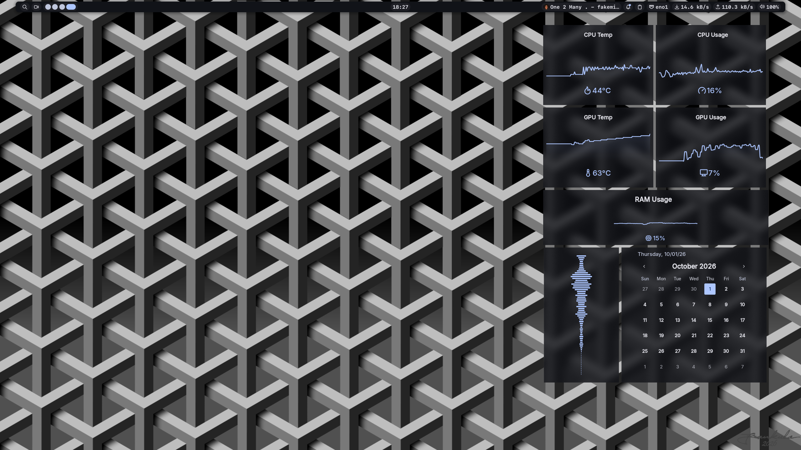
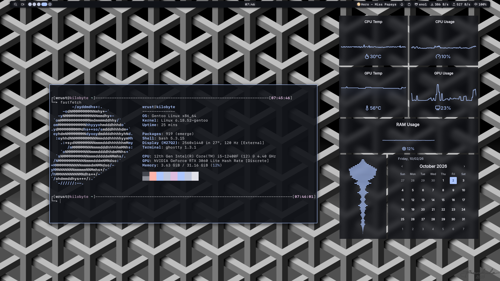

# Dotfiles

u/Gemaroin Linux configuration files.

## Setup

- **Distro:** Gentoo
    
- **Compositor:** [Niri](https://github.com/YaLTeR/niri)
    
- **Terminal:** [Ghostty](https://ghostty.org/)
    
- **Shell:** Bash _(maybe I'll change to zsh in future)_
    
- **Editor:** [VSCodium](https://vscodium.com/)
	
- **Desktop shell:** [Noctalia](https://noctalia.dev/)

> This repository contains my personal configuration.  
> Some settings may require modification before they work correctly on another system.

## Screenshots





## Installation

Clone the repository:

```
git clone https://github.com/USERNAME/dotfiles.git
cd dotfiles
```

Then copy the required configuration files into `~/.config`.
Copy the contents of the `Icons` folder into `~/.local/share/icons`
Copy the contents of the `wallpapers` folder into `~/wallpapers`
## Dependencies

Install the programs used by these dotfiles before applying the configuration.

Example:

```
niri
ghostty
noctalia
starship
```

Additional dependencies may be required by programs.

## Apps I use daily with my config

_I made this a separate heading because you can use other apps_

- Code editor: VS Codium
	
- Chatting: Telegram, Discord
	
- Music: Spotify
	
- File manager: Thunar
	
- Browser: ungoogled chromium
	
- Notes app: Obsidian

## Notes

Some parts of the configuration are system-specific, including:

- monitor names and resolutions;
    
- output configuration;
    
- paths to wallpapers;
    
- usernames and home-directory paths;
    
- GPU-specific settings;

Check the configuration before using it on another machine.

If something breaks, feel free to open issue, I'll try my best to fix it!

## CAUTION

BEFORE USING CHECK THE NIRI CONFIG FILE TO CONFIGURE OUTPUTS!!!!

Use `niri msg outputs` to check available outputs and their modes.

## Themes and fonts

### Fonts
- For GTK apps I use __Inter Regular__ font
- For Noctalia I use __Inter Medium__ font
- For ghostty terminal I use __SF Mono__ font
- For cursor theme I use __[Quintom theme](https://gitlab.com/Burning_Cube/quintom-cursor-theme)__
### Themes and icons
- For GTK i use __adw-gtk3__ to dynamically change the colors to match the wallpaper
- Also I use __[Tela black icons pack](https://github.com/vinceliuice/Tela-icon-theme)__

## License

Feel free to use or modify anything from this repository for your own configuration.